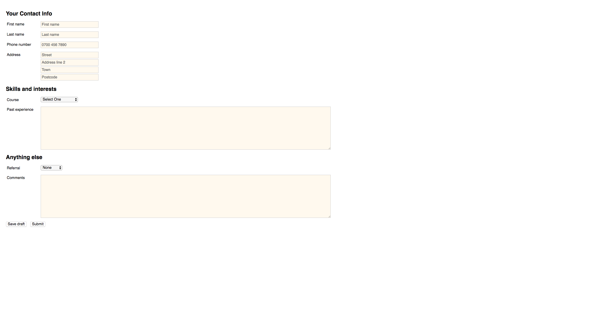

# Laboratorio de formularios receptivos

## Tarea

- Crea una forma receptiva según el diseño

## Criterios de aceptación

- Los colores son `#ccc` y`#fffaf0`
- El pequeño punto de corte es 600px;
- El ancho máximo de `textarea` es`800px`
- ancho máximo de `input` es `250px`
- ancho máximo del `label` es 150px
