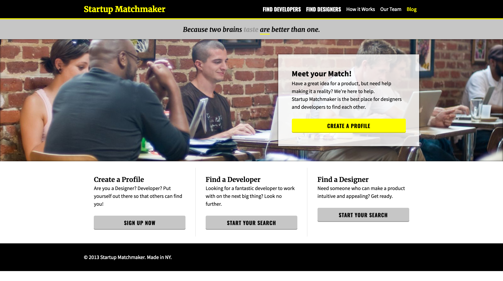
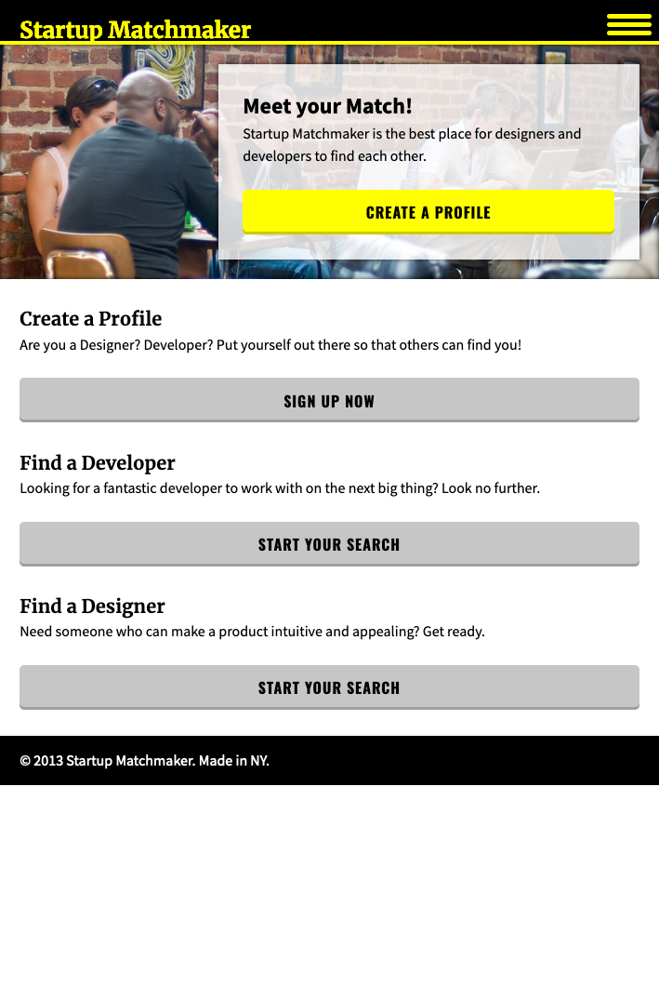

# Desarrollo Web responsivo

## Tarea

Dado los siguientes diseños, por favor crea la siguiente página Web

### Estilos

#### Fuentes

Google fonts:

- Body: `Source Sans Pro`
- Titulos: `Merriweather`
- Botones: `Oswald`

El tamaño base es de `20px`

#### Colores

- `yellow`
- `black`
- `grey`

y sus gradientes

#### Puntos de quiebre (_breakpoints_)

- Mobile: <= `768px`
- Desktop: >= `1080px`

### Desktop

### Mobile

## Credito

Imagen: http://www.flickr.com/photos/mikeschinkel/2733534094/
